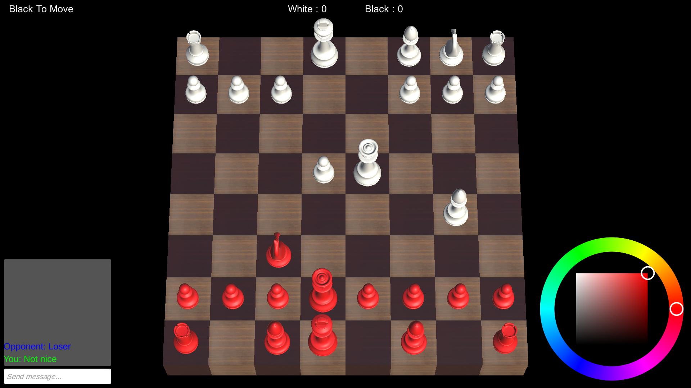
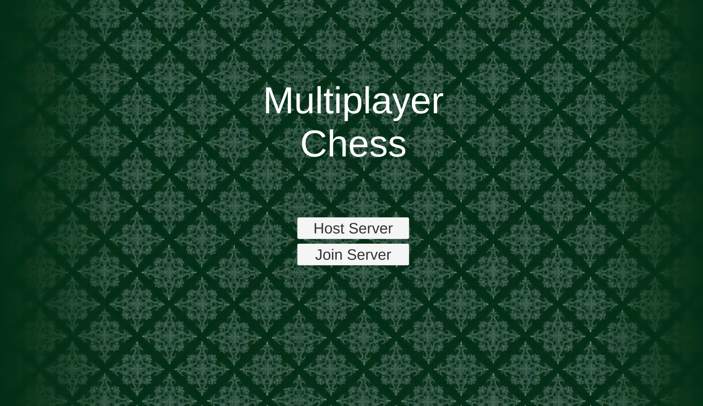
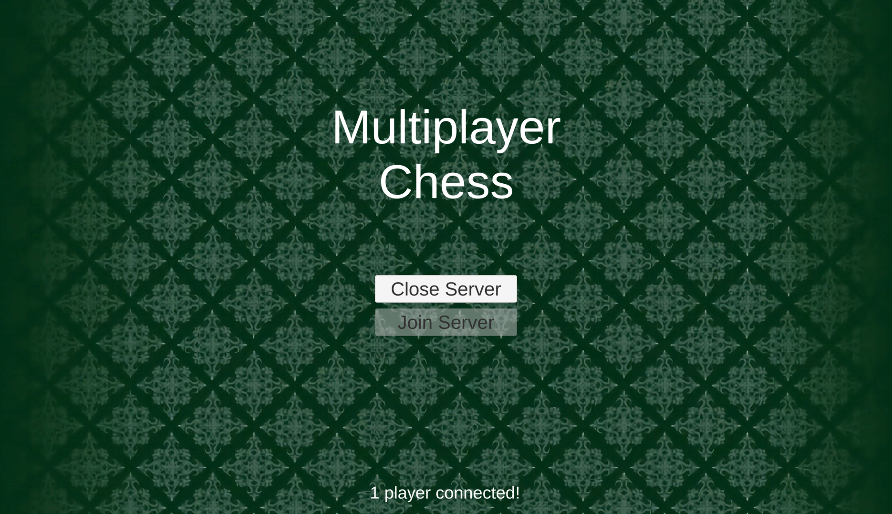
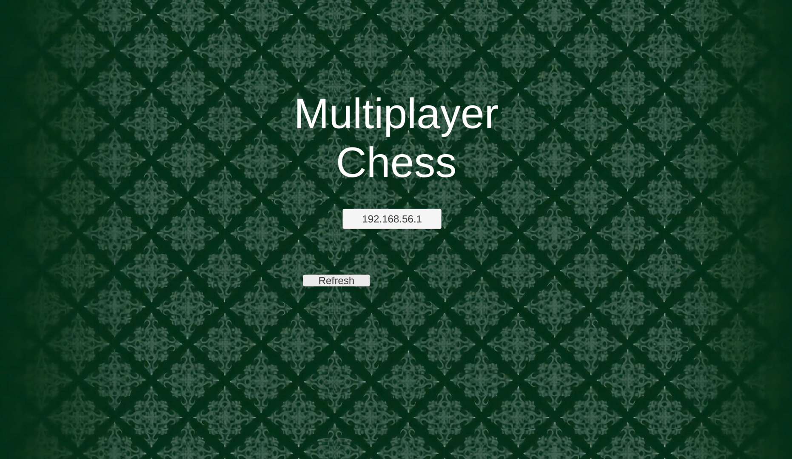
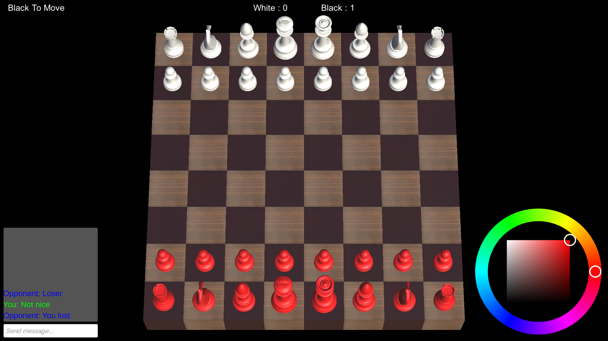

# Multiplayer Chess

LAN multiplayer chess game made using C# Sockets on Unity

To start a game, make sure the two computers are on the same network, then host a game on one of the computer, and click on join game on the other.

Menu:

Host view:

Server discovery view:

In Game Screenshot:

## Features

- Lan Multiplayer
- Chat
- Server Discovery
- Color picking